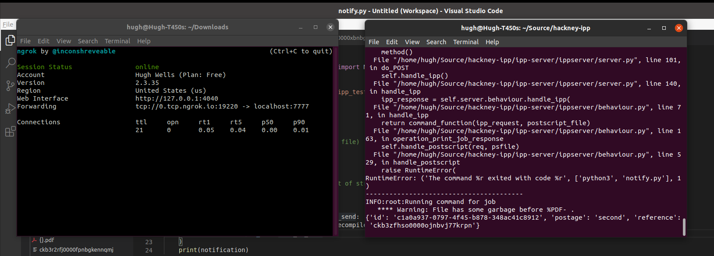
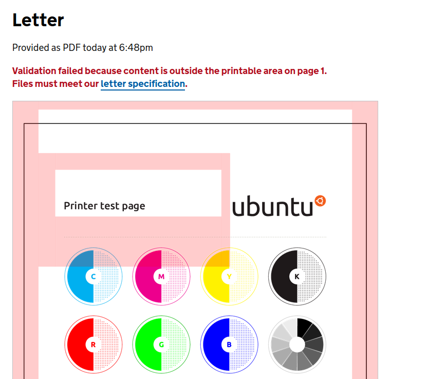
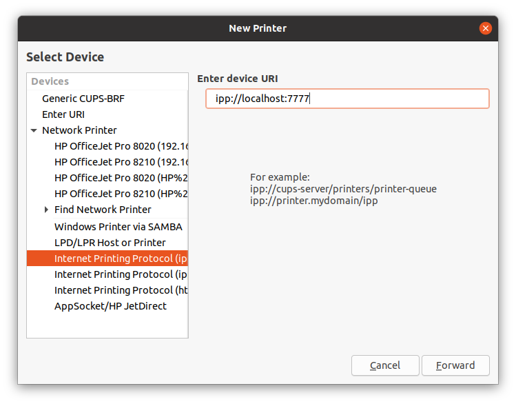
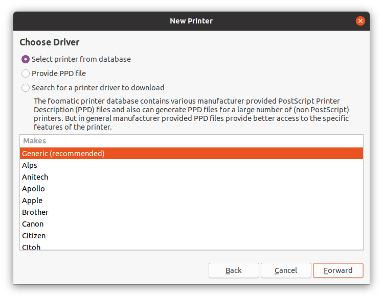
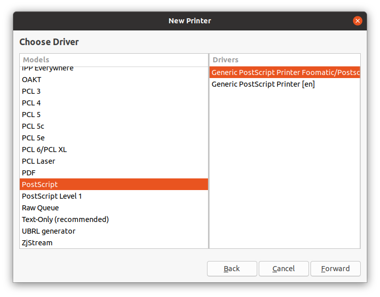

# Print to Notify 

This is a Proof of Concept which transforms [Gov.uk Notify](https://www.notifications.service.gov.uk) into a print server for letters. 

The idea being that in order to mail a letter, you simply need to hit print. 

## Requirements

- Python 3

Pip3 packages:

- [Notify Python SDK](https://docs.notifications.service.gov.uk/python.html)
- [dotenv](https://pypi.org/project/python-dotenv/)
- [cuid](https://github.com/necaris/cuid.py)

Special instructions: 
- [ipp-server](https://github.com/h2g2bob/ipp-server)

(This also uses `ps2pdf` which is part of `ghostscript` - it should be installed by default)

## Setup 

- Install the required Python packages
- Download `ipp-server` and place it in this directory (ie. `hackney-ipp/ipp-server`)
- Create a `.env` file with `NOTIFY_KEY="{your_key_here}"` in the main directory 
- Run `./run.sh` (you may need to `chmod +x run.sh` first if you get a permissions error)
- Add the printer. To do this locally to your machine the connection string you'll need is: `ipp://localhost:7777`. It will also be available on your network at your IP address. 

### Notes regarding adding the printer to machines

- This has only been tested on Ubuntu. 
- You need to add the printer manually (ie. via whatever method you use to specify the URL). It can be made discoverable but it's beyond scope of this PoC. 
- You shouldn't need to install drivers or change settings. It can be added as a PostScript or PDF printer (either works). You can `ctrl + p` on anything from your PC though. 

### Screenshots for printer installation 

*The `system-config-printer` utility*

*Specifying the 'printer' address*

*Choosing the 'Generic' print driver*

*Either set the printer as PDF or PostScript*